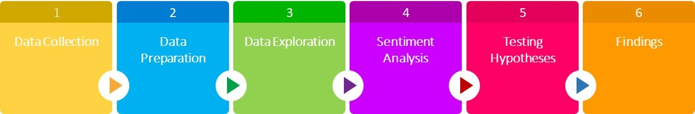

<style type="text/css">

body{ /* Normal  */
      font-size: 12px;
  }
td {  /* Table  */
  font-size: 8px;
}
h1.title {
  font-size: 38px;
  color: #820800;
}
h1 { /* Header 1 */
  font-size: 28px;
  color: #820800;
}
h2 { /* Header 2 */
    font-size: 22px;
  color: #820800;
}
h3 { /* Header 3 */
  font-size: 18px;
  font-family: "Times New Roman", Times, serif;
  color: #820800;
}
code.r{ /* Code block */
    font-size: 12px;
}
pre { /* Code block - determines code spacing between lines */
    font-size: 14px;
}

.list-group-item.active, .list-group-item.active:focus, .list-group-item.active:hover {
    background-color: #820800;
    color:white;
}

</style>


<center></center>


# Introduction
 
## Overview
This project presents the results of an analytic process composed by a sentiment and correlation analyses.  The process was executed on two datasets created using public data from customer reviews and financial performance available on Internet. The analyses are realized using R, a programming language for data analysis, statistical computing and visualization


## Potential benefits
Analysis of customer reviews and star ratings can enable organizations to leverage the following benefits: 

+	Implementation of marketing strategy adjustments.
+	Perform return of investments (ROI) metrics on marketing campaigns.
+	Improve product or service quality.
+	Improve customer service.
+	Monitor and control any crisis management.
+	Attract new customers.
+	Increase sales revenue.


## High level approach


<center></center>


# Data Collection

## Library import
Loading libraries for this project life cycle: **data collection, cleaning, processing & visualization...**

```{r setting, eval=TRUE, warning = FALSE, message=FALSE}


Sys.setenv(JAVA_HOME='C:\\Program Files (x86)\\Java\\jre1.8.0_45') # for 32-bit version

# General-purpose data wrangling
library(tidyverse)  
library(xts)
library(tidytext)
library(tidyverse)
library(stringr)
library(tidyr)
library(scales)
library(broom)
library(purrr)
library(widyr)
library(igraph)
library(ggraph)
library(SnowballC)
library(wordcloud)
library(reshape2)
library(ggpubr)
library(zoo)
library(highcharter)
library(ggridges)
library(radarchart)
library(DT)
# Parsing of HTML/XML files  
library(rvest)    

# String manipulation
library(stringr)   

# Verbose regular expressions
library(rebus)     


# Eases DateTime manipulation
library(lubridate)

#Frequency Tables
library(summarytools)


```


## Web Scraping

<center></center>

Gathering data using **Web scraping...**
```{r collection1, eval=TRUE , warning = FALSE, message=FALSE}


setwd("C:\\Saul\\Portfolio\\Sentiment Analysis") 


#Specifying the url for desired website to be scrapped
url <- 'https://cruiseline.com/ship/oasis-of-the-seas/reviews'
#Reading the html content from Amazon
webpage <- read_html(url)


get_reviews <- function(html){

  # url <- 'https://cruiseline.com/ship/adventure-of-the-seas/reviews'
  # #Reading the html content from Amazon
  # webpage <- read_html(url)
  # html <- read_html(url)

  reviews <- html %>% 
    # The relevant tag

    html_nodes('.review-content') %>%      
    html_text() %>% 
    # Trim additional white space
    str_trim() %>%                       
    # Convert the list into a vector
    unlist()                             

  length(reviews)
  reviews[1:length(reviews)] 
  
  }


get_review_dates <- function(html){
  

  review_dates <- html %>% 
    # The relevant tag
    
    html_nodes('.review-sail-date') %>%      
    html_text() %>% 
    # Trim additional white space
    str_trim() %>%                       
    # Convert the list into a vector
    unlist()                             
  
  length(review_dates)
  review_dates[1:length(review_dates)] 
  
}


get_star_rating <- function(html){
  
  ratings <- html %>% 
    # The relevant tag
    
    html_nodes('.rating-score ') %>%      
    html_text() %>% 
    # Trim additional white space
    str_trim() %>%                       
    # Convert the list into a vector
    unlist()                             
  
  length(ratings)
  ratings[2:length(ratings)]    
  
}


get_data_table <- function(html, company_name){
  
  # Extract the Basic information from the HTML
  reviews <- get_reviews(html)
  dates <- get_review_dates(html)
  ratings <- get_star_rating(html)

  # Combine into a tibble
  combined_data <- tibble(rating = ratings,
                          date = dates,
                          review = reviews) 
  
  # Tag the individual data with the company name
  combined_data %>% 
    mutate(company = company_name) %>% 
    select(rating, date, review)
  
  print(combined_data)
  
  
}


get_data_from_url <- function(url, company_name){
  html <- read_html(url)
  get_data_table(html, company_name)
}


scrape_write_table <- function(url, company_name){
  
  # Read first page
  first_page <- read_html(url)
  
  # Extract the number of pages that have to be queried
  latest_page_number <- round(3026/20,0) - 1
    #get_last_page(first_page)
  
  # Generate the target URLs
  list_of_pages <- str_c(url, '?page=', 1:latest_page_number)
  
  # Apply the extraction and bind the individual results back into one table, 
  # which is then written as a tsv file into the working directory

  list_of_pages %>% 
    # Apply to all URLs
    map(get_data_from_url, company_name) %>%  
    # Combine the tibbles into one tibble
    bind_rows() %>%                           
    # Write a tab-separated file
    write_tsv(str_c(company_name,'.tsv'))     
}


#scrape_write_table(url, 'RCC')

rcc <- read_tsv('RCC.tsv')


#summary(rcc)

```
Checking the number of customer reviews gathered....3K rows, 3 columns.

As well as the interval of time used to extract the reviews.
```{r collection2, eval=TRUE , warning = FALSE, message=FALSE}

dim(rcc); min(rcc$date); max(rcc$date)

rcc_revenues <- read_csv('RCCRevenues.csv')


```


# Data Preparation
## Preparing features
Transforming values to numeric such as the rating.
Formatting date values.
Creating quarter rating information.

```{r Preparation , eval=TRUE , warning = FALSE, message=FALSE}

rcc$rating <- as.numeric(gsub(' out of 5', '', rcc$rating))
rcc$date <-  gsub('Sail Date: ', '', rcc$date) 
rcc$date <- as.Date(gsub(' /', '', rcc$date), "%b%d,%Y" )

rcc$quarter <- as.yearqtr(as.Date( rcc$date, "%m/%d/%Y"))

# generate quarter data

rcc_quarter <- 
  rcc %>% 
  group_by(quarter) %>% 
  summarise_each(funs(mean), rating)

rcc_quarter$rating <- round(rcc_quarter$rating,1)
rcc_quarter$quarter <- as.character(rcc_quarter$quarter)


```
## Table Overview

Taking a look of the review and revenues tables.

```{r collection3, eval=TRUE , warning = FALSE, message=FALSE}


datatable(rcc[(1:20),], filter = 'top', options = list(
  pageLength = 5, scrollX = TRUE, scrollY = "300px", autoWidth = TRUE),  caption = 'Table 1: Customer reviews')

datatable(rcc_revenues[(1:20),], filter = 'top', options = list(
  pageLength = 5, scrollX = TRUE, scrollY = "150px", autoWidth = TRUE),  caption = 'Table 2: Company Revenues')


```


# Data Exploration
## Graphical Overview

```{r Exploration1, eval=TRUE , warning = FALSE, message=FALSE}


#  checking revenues


ggplot(rcc_revenues, aes(quarter, revenue, group=1)) +
  geom_line(aes(y = revenue), colour= "red") + 
  ylab("Revenues") +
  xlab("Quarter") +
  ggtitle("Royal Caribbean revenues from the last 6 years") + #+ theme_bw()+
  theme(axis.text.x = element_text(angle = 45, hjust = 1))


# adding ID
rcc <- tibble::rowid_to_column(rcc, "ID")

############# per month ###################

rcc %>%
  count(Month = round_date(date, "month")) %>%
  ggplot(aes(Month, n)) +
  geom_line(aes(y = n), colour= "blue") + 
  labs(title = "The Number of reviews per month", y = "Frequency", x="Month/Year") + #+ theme_bw()+
  theme(legend.position="top")


rcc <- rcc %>%
  mutate(date = as.POSIXct(date, origin = "2010-01-01"),month = round_date(date, "month"))


qplot(rcc$rating,
      geom="histogram",
      binwidth = 0.1,  
      main = "Distribution of star ratings", 
      xlab = "Star Rating",  
      ylab = "Frequency",
      fill=I("green"), 
      col=I("blue"), 
      alpha=I(.2))


qplot(rcc$rating,
      geom="histogram",
      binwidth = 1,  
      main = "Distribution of star ratings (binwidth = 1)", 
      xlab = "Star Rating",  
      ylab = "Frequency",
      fill=I("yellow"), 
      col=I("red"), 
      alpha=I(.2))

```


## N-Grams

```{r Exploration2, eval=TRUE , warning = FALSE, message=FALSE}


#Create tidy text format: Unnested, Unsummarized, -Undesirables, Stop and Short words

review_words <- rcc %>%
  select(ID, rating, review, date) %>%
  unnest_tokens(word, review) %>%
  filter(!word %in% stop_words$word,
         str_detect(word, "^[a-z']+$"))

review_words


glimpse(review_words)


# unigrams

review_words <- rcc %>%
  distinct(review, .keep_all = TRUE) %>%
  unnest_tokens(word, review, drop = FALSE) %>%
  distinct(ID, word, .keep_all = TRUE) %>%
  anti_join(stop_words, by = "word") %>%
  filter(str_detect(word, "[^\\d]")) %>%
  group_by(word) %>%
  mutate(word_total = n()) %>%
  ungroup()
word_counts <- review_words %>%
  count(word, sort = TRUE)
word_counts %>%
  head(20) %>%
  mutate(word = reorder(word, n)) %>%
  ggplot(aes(word, n)) +
  geom_col(fill = "orange") +
  scale_y_continuous(labels = comma_format()) +
  coord_flip() +
  labs(title = "The most common words in customer reviews from 2010 to date",
       y = "Frequency", x="Word")


## bigrams


review_bigrams <- rcc %>%
  unnest_tokens(bigram, review, token = "ngrams", n = 2)
bigrams_separated <- review_bigrams %>%
  separate(bigram, c("word1", "word2"), sep = " ")
bigrams_filtered <- bigrams_separated %>%
  filter(!word1 %in% stop_words$word) %>%
  filter(!word2 %in% stop_words$word)
bigram_counts <- bigrams_filtered %>% 
  count(word1, word2, sort = TRUE)
bigrams_united <- bigrams_filtered %>%
  unite(bigram, word1, word2, sep = " ")
bigrams_united %>%
  count(bigram, sort = TRUE)


bigram_tf_idf <- bigrams_united %>%
  count(bigram)
bigram_tf_idf <- bigram_tf_idf %>% filter(n>50)
ggplot(aes(x = reorder(bigram, n), y=n), data=bigram_tf_idf) + 
  geom_col(fill = "skyblue") +
 labs(title = "The Most Common bigrams in customer reviews from 2010 to date",
       y = "Frequency", x="Word") + 
  coord_flip()


review_subject <- rcc %>% 
  unnest_tokens(word, review) %>% 
  anti_join(stop_words)
my_stopwords <- data_frame(word = c(as.character(1:10),"royal"  ))
review_subject <- review_subject %>% 
  anti_join(my_stopwords)
title_word_pairs <- review_subject %>% 
  pairwise_count(word, ID, sort = TRUE, upper = FALSE)
set.seed(1234)

title_word_pairs %>%
  filter(n >= 200) %>%
  graph_from_data_frame() %>%
  ggraph(layout = "fr") +
  geom_edge_link(aes(edge_alpha = n, edge_width = n), edge_colour = "pink") +
  geom_node_point(size = 5) +
  geom_node_text(aes(label = name), repel = TRUE, 
                 point.padding = unit(0.2, "lines")) +
  ggtitle("Bigrams as network of words in customer reviews from 2010 to date") + 
  xlab("") +
  ylab("")+
  theme(axis.text = element_blank(),
        axis.ticks = element_blank(),
        panel.grid  = element_blank())

## end bigrams


```


# Sentiment Analysis
## Applying AFINN lexicon 

```{r Sentiment1, eval=TRUE , warning = FALSE, message=FALSE}


sentiment_messages <- review_words %>%
  inner_join(get_sentiments("afinn"), by = "word") %>%
  group_by(ID) %>%
  summarize(sentiment = mean(rating),
            words = n()) %>%
  ungroup() %>%
  filter(words >= 10)

# sentiment_messages %>%  arrange(desc(sentiment))

```
Reviewing a sample of the best reviews

```{r Sentiment2, eval=TRUE , warning = FALSE, message=FALSE}

rcc[ which(rcc$ID==392), ]$review[1]


#sentiment_messages %>%   arrange(sentiment)

```
Reviewing a sample of the worst reviews

```{r Sentiment3, eval=TRUE , warning = FALSE, message=FALSE}

rcc[ which(rcc$ID==557), ]$review[1]

```


```{r Sentiment4, eval=TRUE , warning = FALSE, message=FALSE}


AFINN <- sentiments %>%
  filter(lexicon == "AFINN") %>%
  select(word, afinn_score = score)
# 
# AFINN

reviews_sentiment <- review_words %>%
  inner_join(AFINN, by = "word") %>%
  group_by(ID, rating) %>%
  summarize(sentiment = mean(afinn_score))


reviews_sentiment_integer <- subset(reviews_sentiment,reviews_sentiment$rating %in% c(1,2,3,4,5) )


#ggplot(reviews_sentiment, aes(rating, sentiment, group = rating)) +
 
  ggplot(reviews_sentiment_integer, aes(x = rating, y = sentiment, color = factor(rating), group = rating)) +
   geom_boxplot() +
  geom_hline(yintercept=0, linetype="dashed", color = "red") +
  geom_text(aes(4.7, 0.05, label = "Neutral Sentiment", vjust = 0), size = 4, color = "red") +
  guides(color = guide_legend(title="Star Rating")) +
  labs(y = "Average Sentiment Score", x = "Review Star Rating",
       title = "Sentiment of Royal Caribeean Cruise Reviews, by Star Rating",
       subtitle = "Using the AFINN lexicon")+theme_bw()
  
  
  
  FCA_sentiment <- review_words %>%
    inner_join(get_sentiments("nrc"))
#  FCA_sentiment%>%head()
  
  
  FCA_sentiment_integer <- subset(FCA_sentiment,FCA_sentiment$rating %in% c(1,2,3,4,5) )
  
  

  
  
  #############
  # Graph Using the AFINN lexicon by PERIOD
  #############
  
  review_words %>%
    inner_join(get_sentiments("afinn")) %>%
    group_by(date) %>%
    summarize(average_sentiment = mean(score), words = n()) %>%
    #filter(words >= 10) %>%
    ggplot(aes(date, average_sentiment)) +
    geom_line(aes(y = average_sentiment), colour= "darkgreen") + 
    geom_hline(color = "red", lty = 2, yintercept = 0) +
    labs(y = "Average sentiment score", x = "Year",
         title = "Sentiment of Royal Caribeean Cruise Reviews, by period",
         subtitle = "Using the AFINN lexicon")+
    geom_smooth(method = "loess")

  
  
```

## Applying NRC lexicon 

```{r Sentiment5, eval=TRUE , warning = FALSE, message=FALSE}

  
  
    #############
  # Graph Using the NRC lexicon by PERIOD
  #############
  
  theme_set(theme_bw())
  #Alternatively
  #FCA_sentiment%>%group_by(page, page_total, sentiment)%>%count()
  FCA_sentiment_integer %>%
    count(date, sentiment) %>%
    filter(sentiment %in% c("positive", "negative", 
                            "joy", "trust","fear","sadness"))%>%
    mutate(sentiment = as.factor(sentiment)) %>%
    #ggplot(aes(page, n / page_total, fill = sentiment)) +
    ggplot(aes(date, n / sum(n), fill = sentiment)) +
    geom_area(position = "identity", alpha = 0.5) +
    labs(y = "Relative frequency", x = "Year",
         title = "Sentiment of Royal Caribeean Cruise Reviews, by period",
         subtitle = "Using the NRC lexicon")+theme_bw()+
    scale_fill_manual(values=viridis_pal(option = "D")(6))+
    scale_y_continuous(labels = scales::percent) 
  
  
   #############
  # Graph as stock type
  #############
  
  ldat=review_words %>%
    inner_join(get_sentiments("afinn")) %>%
    group_by(date) %>%
    summarize(average_sentiment = mean(score), words = n())
  
  highchart(type = "stock") %>% 
    hc_title(text = "Sentiment of Royal Caribeean Cruise Reviews, by period") %>% 
    hc_subtitle(text = "") %>% 
    hc_tooltip(valueDecimals = 2) %>% 
    hc_add_series_times_values(ldat$date, ldat$average_sentiment,
                               name = "",color="#440154FF")%>% 
    hc_add_theme(hc_theme_gridlight())%>%
    hc_yAxis(title = list(text = "Average sentiment score"),labels = list(format = "{value}"), max = 4,min=-4,plotLines = list(
      list(label = list(text = ""),
           color = "red",
           width = 2,
           value = 0)))
  
  
  # sUMMARY USING nrc
  
  FCA_sentiment %>%
    count(sentiment, word) %>%
    filter(sentiment %in% c("positive", "negative", 
                            "joy", "trust","fear","sadness")) %>%
    group_by(sentiment) %>%
    top_n(10) %>%
    ungroup %>%
    mutate(word = reorder(word, n)) %>%
    mutate(sentiment = as.factor(sentiment))  %>%
    ggplot(aes(word, n, fill = sentiment)) +
    geom_bar(alpha = 0.8, show.legend = FALSE,stat = "identity") +
    coord_flip() +
    scale_y_continuous(expand = c(0,0)) +
    facet_wrap(~sentiment, scales = "free") +
    labs(y = "Total number of occurrences", x = "",
         title = "Sentiment of Royal Caribeean Cruise Reviews",
         subtitle = "Using the NRC lexicon")+theme_bw()+
    scale_fill_manual(values=viridis_pal(option = "D")(6))
  
  
```

## Applying BING lexicon 

```{r Sentiment6, eval=TRUE , warning = FALSE, message=FALSE}

  
  ##################### bing ###############
  
  
  reviews <- rcc %>% 
    filter(!is.na(review)) %>% 
    select(ID, review) %>% 
    group_by(row_number()) %>% 
    ungroup()
  tidy_reviews <- reviews %>%
    unnest_tokens(word, review)
  tidy_reviews <- tidy_reviews %>%
    anti_join(stop_words)
  
  bing_word_counts <- tidy_reviews %>%
    inner_join(get_sentiments("bing")) %>%
    count(word, sentiment, sort = TRUE) %>%
    ungroup()
  
  bing_word_counts %>%
    group_by(sentiment) %>%
    top_n(10) %>%
    ungroup() %>%
    mutate(word = reorder(word, n)) %>%
    ggplot(aes(word, n, fill = sentiment)) +
    geom_col(show.legend = FALSE) +
    facet_wrap(~sentiment, scales = "free") +
    labs(y = "Contribution to sentiment", x = "",
         title = "Sentiment of Royal Caribeean Cruise Reviews",
         subtitle = "Using the BING lexicon")+theme_bw()+
    coord_flip() + 
    ggtitle('Words that contribute to positive and negative sentiment in the reviews')
  

  
  ##################### end bing ###############
  

```

## Using WordClouds

```{r Sentiment7, eval=TRUE , warning = FALSE, message=FALSE}

    
  
  
    ###################### wordclouds
  
print('A Wordcloud containing the top 100 most frequently occurring words')

  rcc %>%
    unnest_tokens(word, review) %>%
    filter(!word %in% stop_words$word) %>%
    dplyr::count(word,sort = TRUE) %>%
    ungroup()  %>%
    head(50) %>%
    with(wordcloud(word, n, max.words = 100,colors=brewer.pal(8, "Dark2")))
  
  
  
  review_words <- rcc %>%
    unnest_tokens(word, review) %>% #Break the dialogue into individual words
    filter(!nchar(word) < 3) %>% 
    anti_join(stop_words) 
  
  print('A comparison Wordcloud using BING lexicon')
  
  review_words %>%
    inner_join(get_sentiments("bing")) %>%
    dplyr::count(word, sentiment, sort = TRUE) %>%
    acast(word ~ sentiment, value.var = "n", fill = 0) %>%
    comparison.cloud(colors = c("Red", "Steel Blue"),
                     max.words = 50)
  
  
```

## Using Radar chart

```{r Sentiment8, eval=TRUE , warning = FALSE, message=FALSE}

  
  
    ###################### ## radar
  
  review_words <- rcc %>%
    unnest_tokens(word, review) %>% #Break the dialogue into individual words
    filter(!nchar(word) < 3) %>% 
    anti_join(stop_words) 
  
  SW_nrc <- review_words %>%
    inner_join(get_sentiments("nrc"))
  print("Overall NRC Sentiment")
 # head(SW_nrc)
  
  #Get the count of words per sentiment per year
  sentiment_nrc <- SW_nrc %>%
    group_by( sentiment) %>%
    dplyr::count( sentiment) %>%
    mutate(percent_count=n/sum(n)*100)
  
  
  
  radar_chart <- sentiment_nrc %>%
    chartJSRadar(showToolTipLabel = TRUE,
                 main = "Radar Charts of NRC Sentiments")
  
  radar_chart
  
  
```


# Testing Hypotheses

Using the Shapiro function to confirm if the variables are normalized or not. 
```{r Sentiment9, eval=TRUE , warning = FALSE, message=FALSE}

  
  
######################################
## hypothese test
#####################################
  

# ggscatter(reviews_sentiment, x = "rating", y = "sentiment", 
#           add = "reg.line", conf.int = TRUE, 
#           cor.coef = TRUE, cor.method = "pearson",
#           xlab = "Rating", ylab = "Sentiment")


shapiro.test(reviews_sentiment$rating)

shapiro.test(reviews_sentiment$sentiment)

shapiro.test(rcc_revenues$revenue)


ggqqplot(reviews_sentiment$rating, ylab = "Rating")

ggqqplot(reviews_sentiment$sentiment, ylab = "Sentiment")

ggqqplot(rcc_revenues$revenue, ylab = "Revenues")


```

The Shapiro function confirmed that only the revenue variable was normalized.
Hence, We will use the Kendall rank correlation coefficient that can evaluate variables which are not necessarily normalized.

```{r Sentiment10, eval=TRUE , warning = FALSE, message=FALSE}


res<-cor.test(reviews_sentiment$rating,reviews_sentiment$sentiment, method="kendall")
res

rcc_rating_revenue <- merge(rcc_quarter, rcc_revenues,  by = "quarter")

# head(rcc_quarter)
# head(rcc_revenues)


res<-cor.test(rcc_rating_revenue$rating,rcc_rating_revenue$revenue, method="kendall")
res


```

For both cases, the p-value of the tests were less than the significance level alpha = 0.05.

  
# Findings
 
Based on the results of the sentiment analysis, below **findings** were identified:

<center></center>

+ There is an important increasing of the number of reviews starting 2014. In contrast, the sentiment score has had an increase but really slightly.

+ A support to explain the number of reviews as a result of more people taking the service, is the evolution of the revenues. It is clear an increasing of the revenues after 2014.

+ Although after testing the hypotheses, We can confirm that the Sentiment score is correlated to the Star rating, this relationship is low and can be evidenced by the boxplot chart.

+ As a result of using two lexicons: NRC and BING, We can mention how important is the food in this kind of service. Customers do not only consider the quality but also the waiting list for the reservations and for a direct access to the restaurants. 

+ The prior point can be also supported by the fact that the most common words and pairs of words within the customer reviews are: “food”, “time”, “dining”, “main dinning”, “specialty restaurants”, “time dining”, “drink package”.

```{r Findings1, eval=TRUE , warning = FALSE, message=FALSE}

```