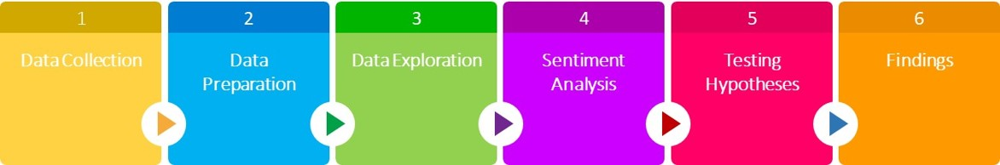

<style type="text/css">

body{ /* Normal  */
      font-size: 12px;
  }
td {  /* Table  */
  font-size: 8px;
}
h1.title {
  font-size: 38px;
  color: #228200;
}
h1 { /* Header 1 */
  font-size: 28px;
  color: #228200;
}
h2 { /* Header 2 */
    font-size: 22px;
  color: #228200;
}
h3 { /* Header 3 */
  font-size: 18px;
  font-family: "Times New Roman", Times, serif;
  color: #228200;
}
code.r{ /* Code block */
    font-size: 12px;
}
pre { /* Code block - determines code spacing between lines */
    font-size: 14px;
}

.list-group-item.active, .list-group-item.active:focus, .list-group-item.active:hover {
    background-color: #228200;
    color:white;
}

</style>


<center></center>


# Introduction
 
## Overview
In this project, we will analyze a dataset composed by job postings in order to discover useful information regarding a specific job title through various text analytics techniques. 
The job title and the location associated with it, used to gather the job posting descriptions, were Data Scientist and Los Angeles respectively. All job postings were filtered by date: January 2019.
Techniques used were tokenization, stemming, lemmatization, n-gram, and so on.


## Purpose
The main purpose of this project is to gain insights that can help job applicants to be familiar with what the organizations are looking for in terms of data scientist positions located in Los Angeles area.

## High level approach


<center></center>

# Data Collection

## Library import
Loading libraries for this project life cycle: **data cleaning, processing & visualization...**

```{r setting, eval=TRUE, warning = FALSE, message=FALSE}

# There are a range of packages in R for doing text analysis. These include:
# 
# hunspell - Tools for spelling, stemming, and tokenization.
# SnowballC - Tools for stemming in a range of languages.
# stringr - Tools for cleaning individual strings (e.g. trimming whitespace).
# text2vec - Tools for tools for text vectorization, topic modeling, and more.
# tidytext - Tools for word processing, sentiment analysis, and tidying text.
# tm - A framework for text mining.
Sys.setenv(JAVA_HOME='C:\\Program Files (x86)\\Java\\jre1.8.0_45') # for 32-bit version

library(tm)
library(tmap)
library(SnowballC)
library(ggplot2)
library(DT)
library(plyr)
library(tibble)
library(RColorBrewer)
library(wordcloud)
library(stringr)
library(textstem)
library(RWeka)
library(qdap)
library(RColorBrewer)
library(udpipe)
library(lattice)
library(filematrix)


```
